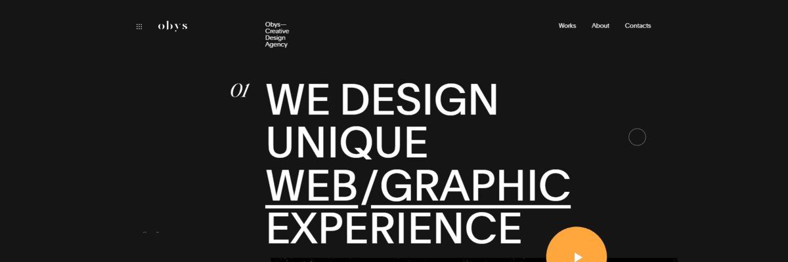
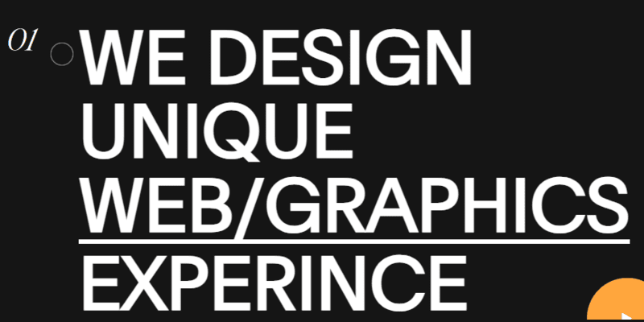
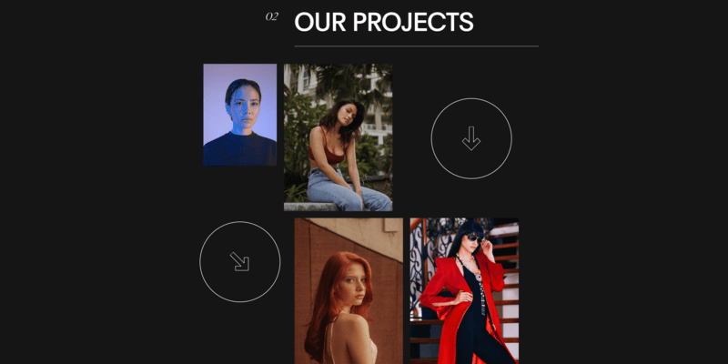
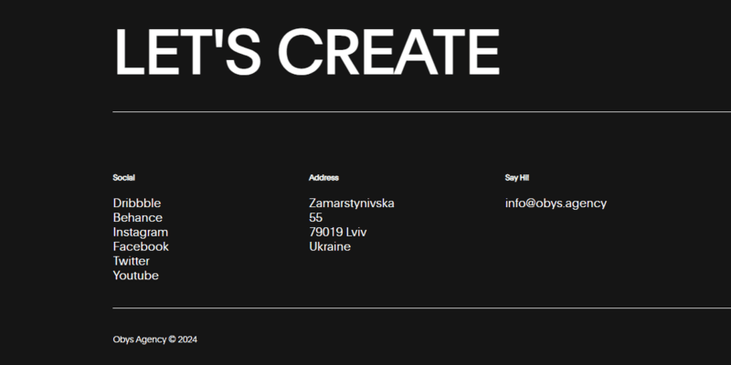

# 🌟 Obys Agency Portfolio Clone

## 📝 Project Overview

Obys Agency Portfolio is a stunning, modern web design showcasing a creative digital agency's portfolio with sophisticated animations and interactive elements. This project demonstrates advanced front-end development techniques using pure HTML, CSS, and JavaScript.



[](https://ahteshamsalamatansari.github.io/obys-agency/)


## ✨ Features

- 🎨 Responsive and elegant design
- 🌈 Smooth scroll animations
- 🖱️ Custom mouse follower effect
- 📸 Interactive image galleries
- 🎬 Scroll-triggered animations
- 🌐 Modern, minimalist UI/UX

## 🛠 Technologies Used


## 🚀 Installation

1. Clone the repository
```bash
git clone https://github.com/ahteshamsalamatansari/obys-agency.git
```

2. Navigate to project directory
```bash
cd obys-agency
```

3. Open `index.html` in your preferred browser

## 🔍 Key Sections

- **Hero Section**: Captivating typography and layout
- **Showreel**: Interactive video preview
- **Project Showcase**: Elegant image grid
- **About Section**: Detailed agency information
- **Footer**: Contact and navigation links

## 📸 Screenshots

<details>
<summary>Click to view project screenshots</summary>




</details>

## 🤝 Contributing

1. Fork the repository
2. Create your feature branch (`git checkout -b feature/AmazingFeature`)
3. Commit your changes (`git commit -m 'Add some AmazingFeature'`)
4. Push to the branch (`git push origin feature/AmazingFeature`)
5. Open a Pull Request

## 🛡️ License

Distributed under the MIT License. See `LICENSE` for more information.

## 📞 Contact

Ahtesham Salamat Ansari 
- GitHub: [@ahteshamsalamatansari](https://github.com/ahteshamsalamatansari)
- Project Link: [https://github.com/ahteshamsalamatansari/obys-agency](https://github.com/ahteshamsalamatansari/obys-agency)

## 🌈 Acknowledgements

- Inspired by Obys Agency's original design
- Special thanks to the open-source community